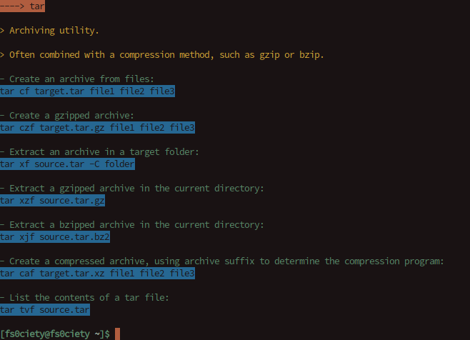

[![Number of files][tokei-image]][tokei-url]
[![license][license-image]][license-url]

[tokei-url]: https://github.com/Jeytas/RubyTldr/tree/master/pages
[tokei-image]: https://tokei.rs/b1/github/Jeytas/RubyTldr?category=files
[license-url]: https://github.com/Jeytas/RubyTldr/blob/master/LICENSE.md
[license-image]: https://img.shields.io/github/license/Jeytas/RubyTldr.svg

# Ruby TLDR
## What is this?
There exists a project called "tldr-pages" which will output a short explanation of the most commonly used command that was specified by the user (tldr tree will yield information about tree in a short yet precise manner). The goal of RubyTldr is to port that project, which was originally written in some other languages, to Ruby. There already exists such a project, however for the sake of getting some programming practice I am now making my own which is quite different from the the other one as far as I have been able to tell.

## Installation and usage
### Installation
To install Tldr you can simply run the following command (on Linux if you have wget installed):

`wget raw.githubusercontent.com/Jeytas/Installers/master/installer_tldr.sh ; bash installer_tldr.sh ; rm -rf installer_tldr.sh`,

download the installer yourself and inspect it before running: 

[Installer](https://raw.githubusercontent.com/Jeytas/Installers/master/installer_tldr.sh) 

or just clone the repository and install it yourself.

__NOTE__: The installer requires you to have `git`, `wget` installed on your system and also requires your shell to be Bash.

### Usage
#### Preamble
After using one of the installers that I provided, please try and run `tldr tldr`. If that command executes correctly, then you have successfully installed RubyTldr. In case the command cannot be found, please restart your current terminal and try again. Should that still not solve the problem, please open an Issue on this Github Repo. 

#### General usage
The usage of RubyTldr is as straightforward as the original tldr – Simply start the .rb file and append a command you wish to get more information on and RubyTldr will display it on your terminal in various colours. I will be adding an installer which will be similar to the installler I've already created for my RuXt programhelp for that programhelp for that program

### Contributing
I welcome all contributions, be it actual code contributions, bug reports etc. If you want to make your own version of this program, you are free to do so. It is licensed under the GNU General Public license v3. If you wish to know exactly what you are and aren't allowed to do, please refer to the LICENSE document in this repository.
