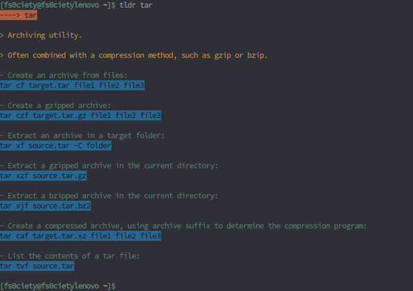
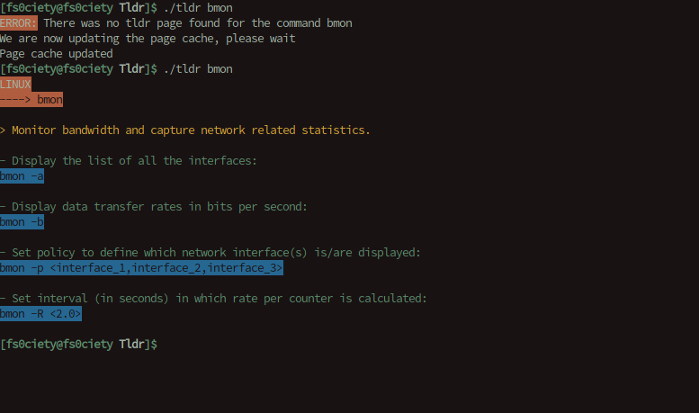

[![license][license-image]][license-url]

[license-url]: https://github.com/Jeytas/RubyTldr/LICENSE.md
[license-image]: https://img.shields.io/github/license/Jeytas/RubyTldr.svg

# RubyTldr

## What is this?
Recently, I discovered the 'tldr-pages' project and I found it very useful. The projects main idea is very simple – Providing scaled down man-pages that are easy to read, quick to understand and have the most important commands easily visible with examples. The problem with most man-pages is that they are often written in a difficult to understand manner, they often contain way too much information and the information you're looking for might be buried on some pages later.
The original tldr-pages is written in a variety of languages as far as I am able to tell. There is a Ruby port already available, however I wanted to create my own port of it to Ruby, mainly as programming exercise. This project is not based on the already available 'tldrb'.

## Installation
__NOTE__: The only operating system that is currently supported for installation is Linux and the program will not run if you are using a different operating system.

I tried keeping the installation process as easy and accessible as possible. I am still new to shell scripting, so errors might occur when installing the program. If you encounter an error, please file an Issue on this Repository.

### Automatic installation
__WARNING__: When you install RubyTldr using one of my installers, please be aware that it might potentially break other "tldr" installations you have installed on your computer. When you run the installer, an alias is added into your .bashrc file which might conflict with other pre-existing tldr installations.

__NOTE__: The installer requires you to have `git` and `wget` installed on your system and also requires your shell to be Bash.

To install Tldr you can simply run the following command:

`wget raw.githubusercontent.com/Jeytas/Installers/master/installer_tldr.sh ; bash installer_tldr.sh ; rm -rf installer_tldr.sh`

Should you want to inspect the source code of the downloader before running it, you can view it here:

[Installer](https://raw.githubusercontent.com/Jeytas/Installers/master/installer_tldr.sh)

### Manual installation
If you do not want to download any of my installers because you don't trust them or you simply want to download it yourself, you can do so very easily. Simply download this repository (there's a green button at the top that allows you to do so) and extract it. When you open the folder you extracted it into, you will see the same files as on this repository. If you want to start RubyTldr, then you simply type `./tldr` while you are in the RubyTldr directory.

## Usage
### Preamble
After using one of the installers that I provided, please try and run `tldr --help`. If that command executes correctly, then you have successfully installed RubyTldr. In case the command cannot be found, please restart your current terminal and try again. Should that still not solve the problem, please open an Issue on this Github Repo.

### Ruby version
I am using Ruby 2.4.2, so it's only officially supported on that version. However, I am very certain it will work on older or newer versions of Ruby as well.

### General usage
The usage of RubyTldr is as straightforward as the original tldr – Simply type "tldr" and append a command you wish to get more information on and RubyTldr will display it on your terminal in various colours (if you type tldr tar the information you can see on the picture at the top of this Readme will be displayed).
There are also two flags you can use:
* `--help` will provide you with some help regarding the programming
* `--list` will list all the available commands

If you want to use `--list`, I would highly recommend combining it with other Unix commands using the Unix pipeline as such: `tldr --list | sort | less`. This will sort the commands alphabetically and put them into a scroll-able list. To search for a specific command you can use `grep` as such `tldr --list | grep -i "search_term_here"`

The words displayed in `<>` are to be replaced by the user according to their needs. For example, in the `tldr tar`, the following means `tar xf replace_this_string_with_your_desired_tar_file -C replace_this_string_with_the_folder_you_want_to_extract_the_tar_to` : `tar xf <source.tar> -C <folder>`. The `<>` do not need to be written into the command, they just signify that it should be replaced according to what the user wants to use the command on.

### Tldr pages for other operating systems
You are able to access all the tldr pages from whatever operating system. The operating system the command is intended to be used on is the first thing on the Tldr page, written in all capital letters.

### New tldr pages
The original tldr project is alive and well. New pages are being added regularly and old ones are being updated. In order to keep up with all the changes, I implemented a feature that will automatically try to download commands that weren't found on your machine. If it is able to find the responding tldr-page on the official Github Repository, it will download it and you will be able to use it locally as well.

## Troubleshooting
### Program doesn't start
#### Wrong operating system
The main culprit for this will be that you are using the wrong operating system. If you are using Windows or Mac or anything other than Linux-based operating systems, the program will refuse to run. You can remove the code that checks for the operating system in the `tldr.rb` file located in `lib/bin`. However, I can not assure you that RubyTldr will work then

#### Gems not installed
RubyTldr relies on two extensions of the Ruby programming language, so-called gems. These gems are `colorize` and `rubyzip`. `colorize` will format the output and colorize it so that it looks more appealing and `rubyzip` will extract the .zip file that contains the pages. You need to have both of these gems installed for the program to run. Generally, the program checks if the needed gems are installed on your system and install them if needed. However, that might fail. In that case, please try and install the gems manually.

### Program used to work but no longer does
If you update the page cache without an active internet connecting, RubyTldr will have already deleted the pages directory and the program cannot find the pages anymore and crashes. This is a known bug which I am trying to fix. In the meantime, try not to update your pages without an active internet connection. Should you already have done so, you can simply download the `tldr.zip` file from here: [https://tldr.sh/assets/tldr.zip](https://tldr.sh/assets/tldr.zip). Afterwards, go into the `lib/` directory and extract it.

## TODO
Please refer to the TODO.md document located in this repository for an always updated TODO-list. However, there are still a few things in general that I need to restructure and improve, most of which won't directly impact the user experience. One important feature that I haven't added yet is being able to look at the tldr pages of a specific operating system which is available on the original tldr-pages project. Also, I often add `#TODO` comments to my code, so you might find more information in the source code as well.

## Contributing
I welcome all contributions, be it actual code contributions, bug reports etc. If you want to make your own version of this program, you are free to do so. It is licensed under the GNU General Public License Version 3 (GPLv3). It's one of the most popular free software license and it allows the users to do virtually anything with the software. But before you do, and you wish to know exactly what you are and aren't allowed to do, please refer to the LICENSE document in this repository.

__Please do not add new tldr pages to this Github repository__

If you wish to create your own tldr pages (as in the actual explanation pages), then I would highly encourage you to do so on the original Github repository which is simply called [tldr](https://github.com/tldr-pages/tldr).
